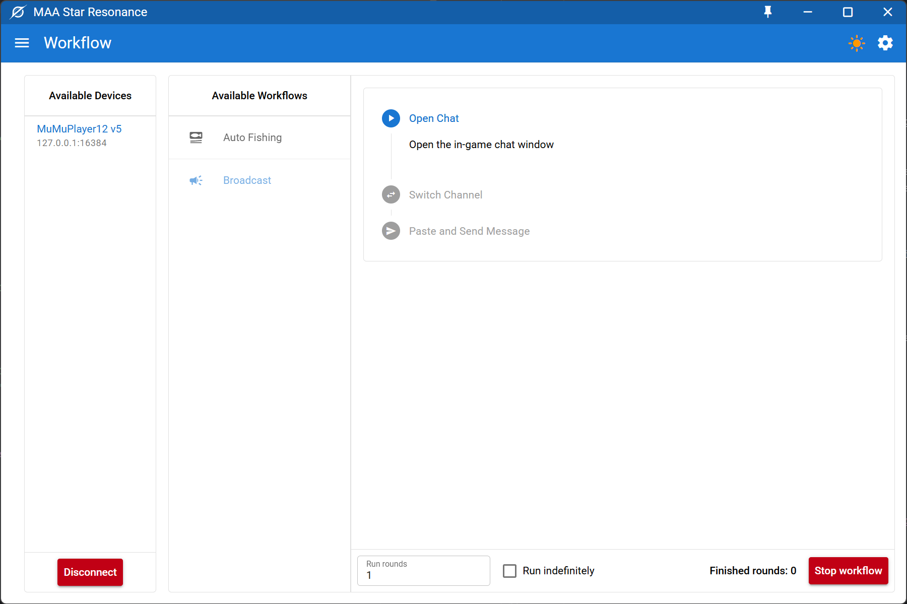

<div style="text-align: center">

# MAA Star Resonance


**A Star Resonance helper powered by Quasar and MAA frameworks**

*This application only works with Android emulators and devices.*

</div>

## Table of Contents

- [Screenshots](#screenshots)
- [Usage](#usage)
- [Development Setup](#development-setup)

## Screenshots



## Usage

### Auto fishing

This workflow automates the fishing process.

1. Make sure your character is in a fishing spot in the game.
2. Select your device with the correct port.
3. Select the "Auto Fishing" workflow.
4. Set run rounds at the bottom of the workflow info panel.
5. Click "Run Workflow" to start the auto fishing process.

### Broadcast message

This workflow automates the process of sending messages in specific world channels.

1. Open workflow config drawer by clicking the gear icon on the top right.
2. Setup begin channel and end channel.
3. Close the workflow config drawer by clicking the gear icon again.
4. Set run rounds at the bottom of the workflow info panel.
5. Click "Run Workflow" to start broadcasting messages.

## Development Setup

### Install the dependencies

```bash
pnpm install
```

### Start the app in development mode (hot-code reloading, error reporting, etc.)

```bash
pnpm run dev
```

### Lint the files

```bash
pnpm run lint
```

### Format the files

```bash
pnpm run format
```

### Build the app for production

```bash
pnpm run publish
```
